# 🏡 Rent Aura

This is a **full-stack Airbnb clone** built with **Next.js**. The platform allows users to **rent properties**, **leave reviews**, **filter listings**, and **process payments with Stripe**. It also includes an **admin dashboard** for managing properties and bookings.

## 🚀 Features

- 🔑 **Authentication with Clerk (Login / Register)**
- ✅ **Full form validation**
- 🏠 **List and rent properties for specific dates**
- 💳 **Stripe integration for secure payments**
- ⭐ **Leave and view property reviews**
- 🔎 **Search & filter listings by location, price, and availability**
- 🛠 **Admin dashboard for managing properties and users**
- ⚡ **Optimized UI with Tailwind CSS**
- 📂 **Responsive design for mobile and desktop**

## 🛠 Tech Stack

- **Frontend:** Next.js, React, Tailwind CSS
- **Authentication:** Clerk (for user login & register)
- **Payments:** Stripe API
- **Database:** PostgreSQL (via Supabase and Prisma)
- **Backend:** Next.js API Routes
- **Deployment:** Vercel

## 📸 Project Screenshots

### 🔐 Login / Register
Secure authentication with Clerk.
 
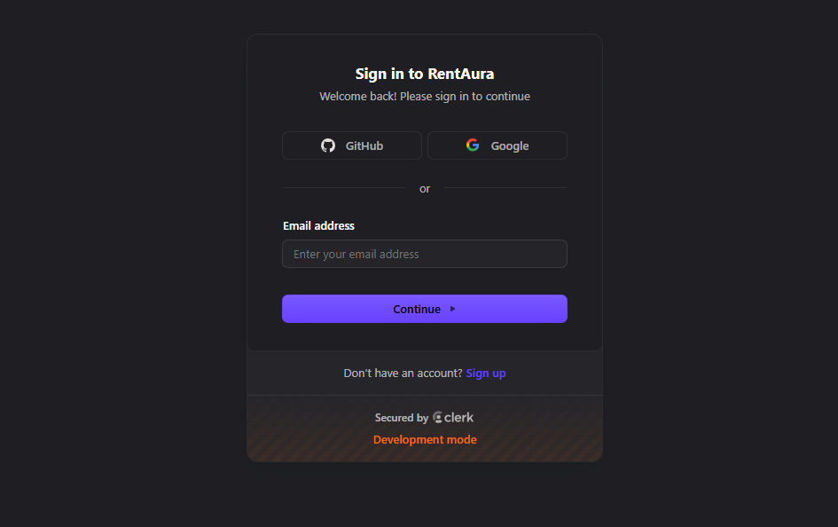
 

### 🏠 Home Page
Main landing page showing property listings.
 
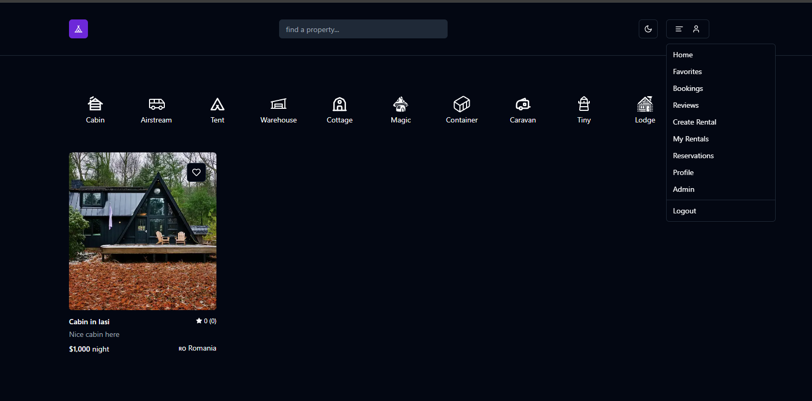
 

### ✏️ Creating & Editing Property
Users can create and edit property listings dynamically.
 
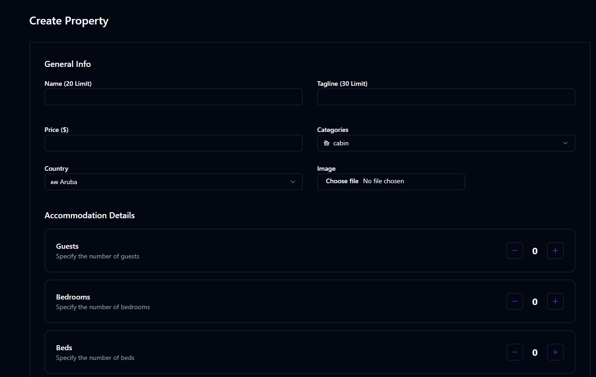
 
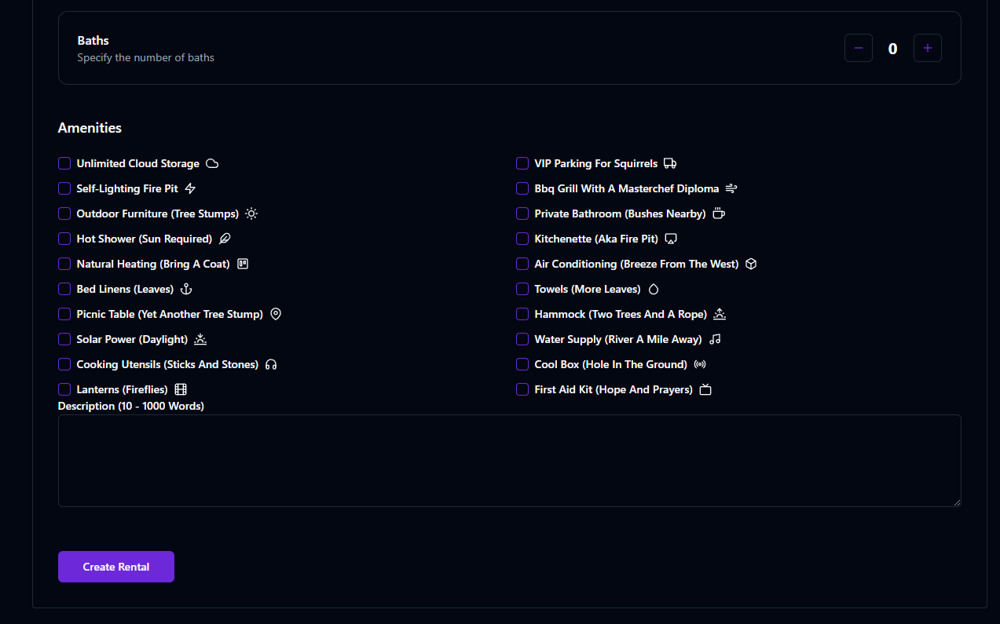
 

### 📅 Booking Property
Renters can book properties for a specific period
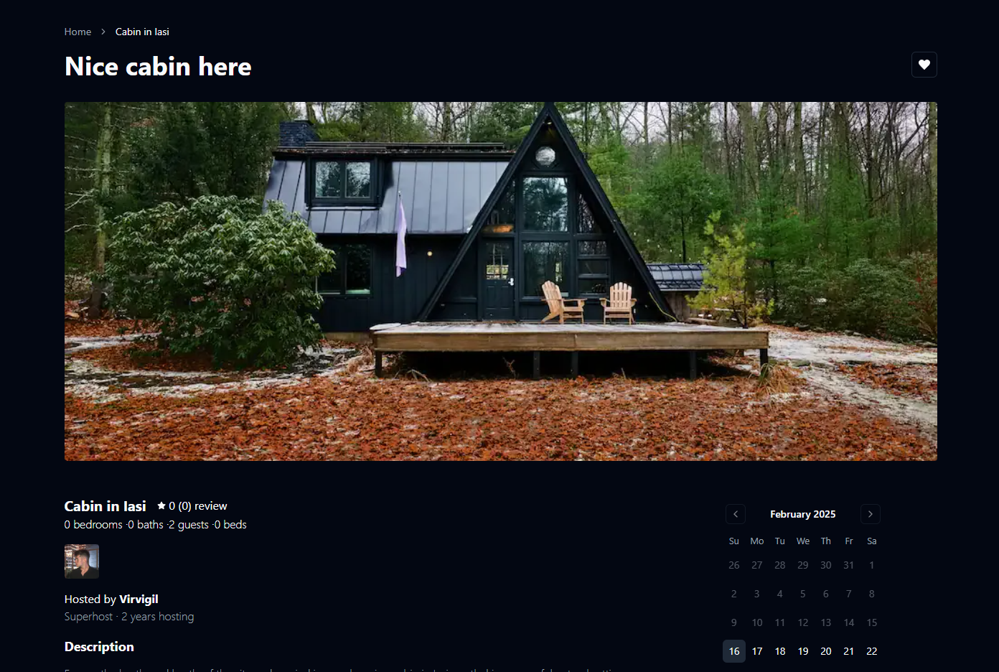
 
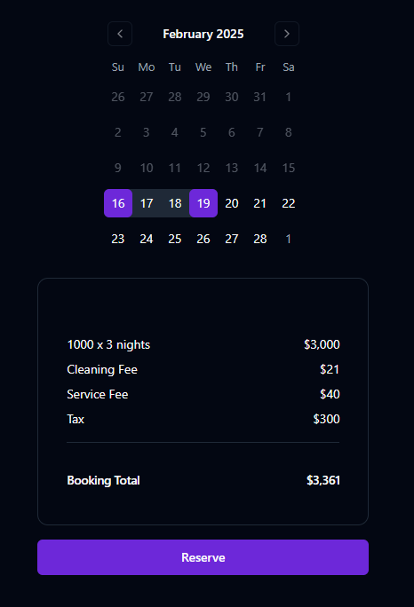
 
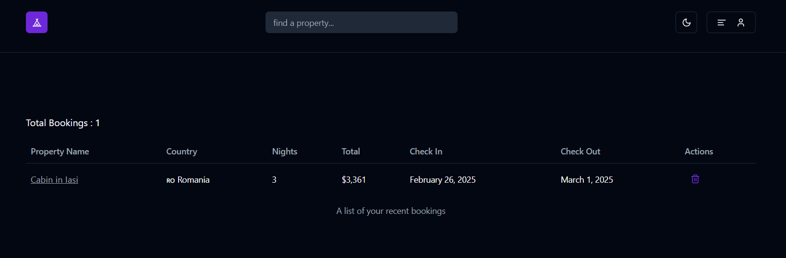
 

### 🏠 Reservation Tab on Owner's Property
Property owners can see all upcoming and past reservations.
 
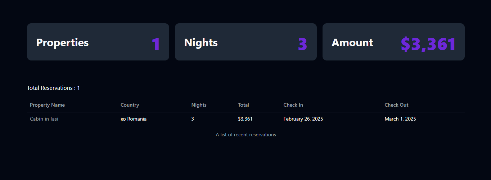
 

### 📖 My Rentals
Users can view all properties they have rented.
 
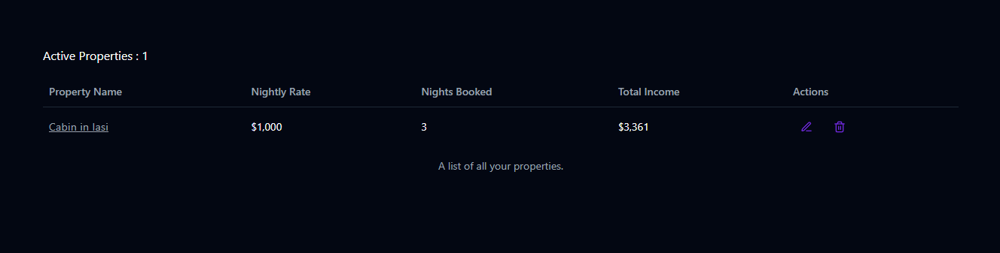
 

### ⭐ Reviews & Ratings
Users can leave and read reviews for properties.
 

 
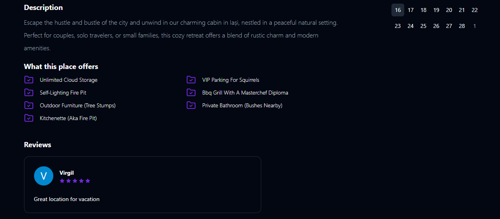
 

### ❤️ Favorite Tab
Save favorite properties for quick access.
 
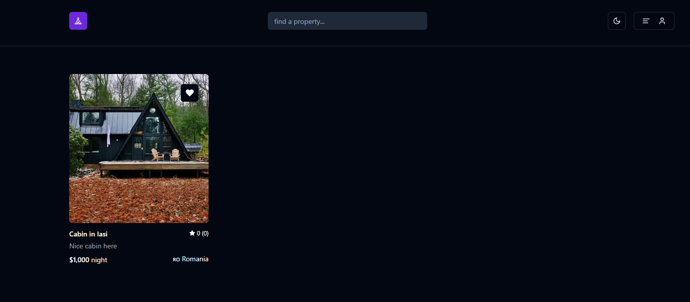
 

### 💳 Stripe Checkout
Secure payment processing with Stripe.
 
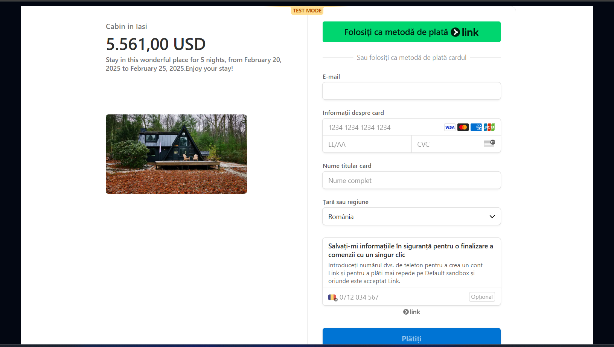
 

### 🛠 Admin Dashboard
Manage users, properties, and bookings.
 
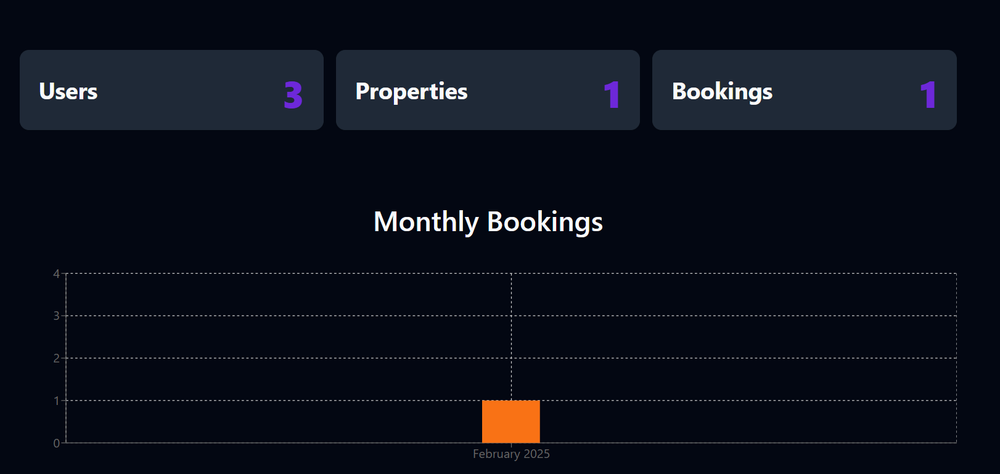
 
